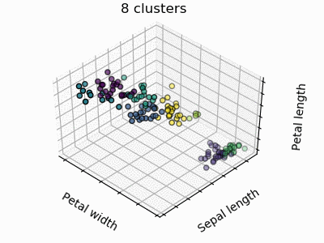
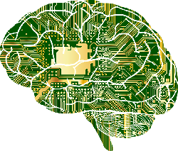

.. figure:: _img/teaser.gif
  :target: https://machinelearningmindset.com/blog/
  
.. figure:: _img/subscribe.gif
  :target: https://machinelearningmindset.com/subscription/

###################################################
A Machine Learning Course with Python
###################################################

.. image:: https://img.shields.io/badge/contributions-welcome-brightgreen.svg?style=flat
    :target: https://github.com/pyairesearch/machine-learning-for-everybody/pulls
.. image:: https://badges.frapsoft.com/os/v2/open-source.png?v=103
    :target: https://github.com/ellerbrock/open-source-badge/
.. image:: https://img.shields.io/badge/Made%20with-Python-1f425f.svg
      :target: https://www.python.org/
.. image:: https://img.shields.io/github/contributors/machinelearningmindset/machine-learning-course.svg
      :target: https://github.com/machinelearningmindset/machine-learning-course/graphs/contributors
.. image:: https://img.shields.io/badge/book-pdf-blue.svg
   :target: https://machinelearningmindset.com/wp-content/uploads/2019/06/machine-learning-course.pdf
.. image:: https://img.shields.io/badge/official-documentation-green.svg
   :target: https://machine-learning-course.readthedocs.io/en/latest/
.. image:: https://img.shields.io/twitter/follow/machinemindset.svg?label=Follow&style=social
      :target: https://twitter.com/machinemindset
   
   
   

##################
Table of Contents
##################
.. contents::
  :local:
  :depth: 4

========================
Introduction
========================

The purpose of this project is to provide a comprehensive and yet simple course in Machine Learning using Python.
You can access to the full documentation with the following links: |Book| |Documentation|

.. |Book| image:: https://img.shields.io/badge/book-pdf-blue.svg
   :target: https://machinelearningmindset.com/wp-content/uploads/2019/06/machine-learning-course.pdf
.. |Documentation| image:: https://img.shields.io/badge/official-documentation-green.svg
   :target: https://machine-learning-course.readthedocs.io/en/latest/

============
Motivation
============

``Machine Learning``, as a tool for ``Artificial Intelligence``, is one of the most widely adopted
scientific fields. A considerable amount of literature has been published on Machine Learning.
The purpose of this project is to provide the most important aspects of ``Machine Learning`` by presenting a
series of simple and yet comprehensive tutorials using ``Python``. In this project, we built our
tutorials using many different well-known Machine Learning frameworks such as ``Scikit-learn``. In this project you will learn:

* What is the definition of Machine Learning?
* When it started and what is the trending evolution?
* What are the Machine Learning categories and subcategories?
* What are the mostly used Machine Learning algorithms and how to implement them?

=====================
Machine Learning
=====================

+--------------------------------------------------------------------+-------------------------------+
| Title                                                              |    Document                   |
+====================================================================+===============================+
| An Introduction to Machine Learning                                |   `Overview <Intro_>`_        |
+--------------------------------------------------------------------+-------------------------------+

.. _Intro: docs/source/intro/intro.rst

------------------------------------------------------------
Machine Learning Basics
------------------------------------------------------------

.. figure:: _img/intro.png
.. _lrtutorial: docs/source/content/overview/linear-regression.rst
.. _lrcode: code/overview/linear_regression

.. _overtutorial: docs/source/content/overview/overfitting.rst
.. _overcode: code/overview/overfitting

.. _regtutorial: docs/source/content/overview/regularization.rst
.. _regcode: code/overview/regularization

.. _crosstutorial: docs/source/content/overview/crossvalidation.rst
.. _crosscode: code/overview/cross-validation

+--------------------------------------------------------------------+-------------------------------+--------------------------------+
| Title                                                              |    Code                       |    Document                    |
+====================================================================+===============================+================================+
| Linear Regression                                                  | `Python <lrcode_>`_           | `Tutorial <lrtutorial_>`_      |
+--------------------------------------------------------------------+-------------------------------+--------------------------------+
| Overfitting / Underfitting                                         | `Python <overcode_>`_         | `Tutorial <overtutorial_>`_    |
+--------------------------------------------------------------------+-------------------------------+--------------------------------+
| Regularization                                                     | `Python <regcode_>`_          | `Tutorial <regtutorial_>`_     |
+--------------------------------------------------------------------+-------------------------------+--------------------------------+
| Cross-Validation                                                   | `Python <crosscode_>`_        | `Tutorial <crosstutorial_>`_   |
+--------------------------------------------------------------------+-------------------------------+--------------------------------+

------------------------------------------------------------
Supervised learning
------------------------------------------------------------

.. figure:: _img/supervised.gif

.. _dtdoc: docs/source/content/supervised/decisiontrees.rst
.. _dtcode: code/supervised/DecisionTree/decisiontrees.py

.. _knndoc: docs/source/content/supervised/knn.rst
.. _knncode: code/supervised/KNN/knn.py

.. _nbdoc: docs/source/content/supervised/bayes.rst
.. _nbcode: code/supervised/Naive_Bayes

.. _logisticrdoc: docs/source/content/supervised/logistic_regression.rst
.. _logisticrcode: supervised/Logistic_Regression/logistic_ex1.py

.. _linearsvmdoc: docs/source/content/supervised/linear_SVM.rst
.. _linearsvmcode: code/supervised/Linear_SVM/linear_svm.py

+--------------------------------------------------------------------+-------------------------------+------------------------------+
| Title                                                              |    Code                       |    Document                  |
+====================================================================+===============================+==============================+
| Decision Trees                                                     | `Python <dtcode_>`_           | `Tutorial <dtdoc_>`_         |
+--------------------------------------------------------------------+-------------------------------+------------------------------+
| K-Nearest Neighbors                                                | `Python <knncode_>`_          | `Tutorial <knndoc_>`_        |
+--------------------------------------------------------------------+-------------------------------+------------------------------+
| Naive Bayes                                                        | `Python <nbcode_>`_           |  `Tutorial <nbdoc_>`_        |
+--------------------------------------------------------------------+-------------------------------+------------------------------+
| Logistic Regression                                                | `Python <logisticrcode_>`_    |  `Tutorial <logisticrdoc_>`_ |
+--------------------------------------------------------------------+-------------------------------+------------------------------+
| Support Vector Machines                                            | `Python <linearsvmcode_>`_    | `Tutorial <linearsvmdoc_>`_  |
+--------------------------------------------------------------------+-------------------------------+------------------------------+

------------------------------------------------------------
Unsupervised learning
------------------------------------------------------------

.. _clusteringdoc: docs/source/content/unsupervised/clustering.rst
.. _clusteringcode: code/unsupervised/Clustering

.. _pcadoc: docs/source/content/unsupervised/pca.rst
.. _pcacode: code/unsupervised/PCA

+--------------------------------------------------------------------+-------------------------------+--------------------------------+
| Title                                                              |    Code                       |    Document                    |
+====================================================================+===============================+================================+
| Clustering                                                         | `Python <clusteringcode_>`_   | `Tutorial <clusteringdoc_>`_   |
+--------------------------------------------------------------------+-------------------------------+--------------------------------+
| Principal Components Analysis                                      | `Python <pcacode_>`_          | `Tutorial <pcadoc_>`_          |
+--------------------------------------------------------------------+-------------------------------+--------------------------------+

------------------------------------------------------------
Deep Learning
------------------------------------------------------------

.. _mlpdoc: docs/source/content/deep_learning/mlp.rst
.. _mlpcode: code/deep_learning/mlp

.. _cnndoc: docs/source/content/deep_learning/cnn.rst
.. _cnncode: code/deep_learning/cnn

.. _aedoc: docs/source/content/deep_learning/autoencoder.rst
.. _aecode: code/deep_learning/autoencoder

.. _rnndoc: code/deep_learning/rnn/rnn.ipynb
.. _rnncode: code/deep_learning/rnn/rnn.py

+--------------------------------------------------------------------+-------------------------------+---------------------------+
| Title                                                              |    Code                       |    Document               |
+====================================================================+===============================+===========================+
| Neural Networks Overview                                           |    `Python <mlpcode_>`_       |  `Tutorial <mlpdoc_>`_    |
+--------------------------------------------------------------------+-------------------------------+---------------------------+
| Convolutional Neural Networks                                      |    `Python <cnncode_>`_       | `Tutorial <cnndoc_>`_     |
+--------------------------------------------------------------------+-------------------------------+---------------------------+
| Autoencoders                                                       |    `Python <aecode_>`_        | `Tutorial <aedoc_>`_      |
+--------------------------------------------------------------------+-------------------------------+---------------------------+
| Recurrent Neural Networks                                          |    `Python <rnncode_>`_       |  `IPython <rnndoc_>`_     |
+--------------------------------------------------------------------+-------------------------------+---------------------------+

========================
Pull Request Process
========================

Please consider the following criterions in order to help us in a better way:

1. The pull request is mainly expected to be a link suggestion.
2. Please make sure your suggested resources are not obsolete or broken.
3. Ensure any install or build dependencies are removed before the end of the layer when doing a
   build and creating a pull request.
4. Add comments with details of changes to the interface, this includes new environment
   variables, exposed ports, useful file locations and container parameters.
5. You may merge the Pull Request in once you have the sign-off of at least one other developer, or if you
   do not have permission to do that, you may request the owner to merge it for you if you believe all checks are passed.

========================
Final Note
========================

We are looking forward to your kind feedback. Please help us to improve this open source project and make our work better.
For contribution, please create a pull request and we will investigate it promptly. Once again, we appreciate
your kind feedback and support.

========================
Developers
========================

**Creator**: Machine Learning Mindset [`Blog
<https://machinelearningmindset.com/blog/>`_, `GitHub
<https://github.com/machinelearningmindset>`_, `Twitter
<https://twitter.com/machinemindset>`_]

**Supervisor**: Amirsina Torfi [`GitHub
<https://github.com/astorfi>`_, `Personal Website
<https://astorfi.github.io/>`_, `Linkedin
<https://www.linkedin.com/in/amirsinatorfi/>`_ ]

**Developers**: Brendan Sherman\*, James E Hopkins\* [`Linkedin <https://www.linkedin.com/in/jhopk>`_], Zac Smith [`Linkedin <https://www.linkedin.com/in/zac-smith-a7bb60185/i>`_]

\*: equally contributed
