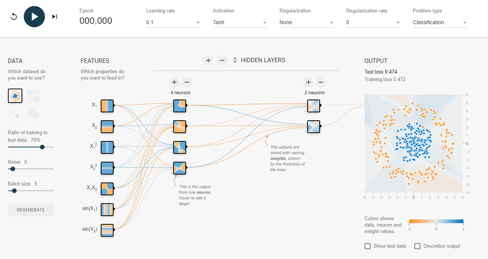
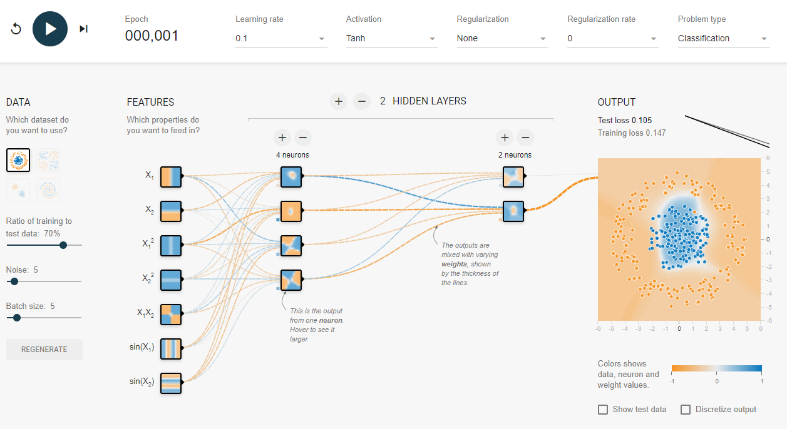
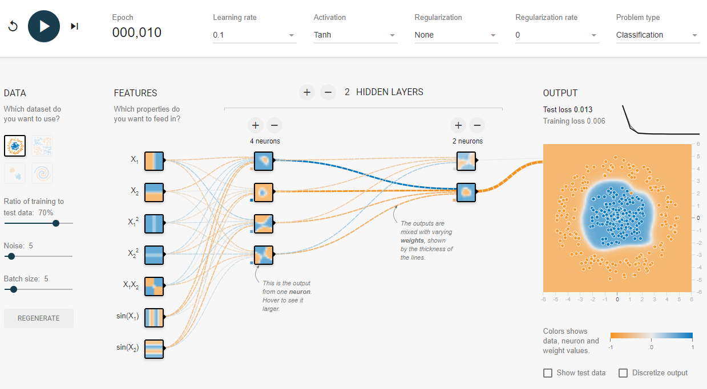

##########
Multi-layer Perceptron
##########

.. contents::
  :local:
  :depth: 3

********
Overview
********

A multilayer perceptron (MLP) is a deep, artificial **neural network**.
A *neural network* is comprised of layers of nodes which activate at various
levels depending on the previous layer's nodes.
When thinking about neural networks, it may be helpful to isolate your thinking to a single node in the network.

Multilayer perceptron refers to a neural network with at least three layers of nodes, an input layer, some
number of intermediate layers, and an output layer.
Each node in a given layer is connected to every node in the adjacent layers.
The input layer is just that, it is the way the network takes in data.
The intermediate layer(s) are the computational machine of the network, they
actually transform the input to the output.
The output layer is the way that results are obtained from the neural network.
In a simple network where the responses are binary, there would likely be only one node in the output layer,
which outputs a probability like in `logistic regression`_.

.. _logistic regression: https://machine-learning-course.readthedocs.io/en/latest/content/supervised/logistic_regression.html

For a visual look at a neural network in action, play with this website_ where
you can see a number recognition neural network.
In this section, the ideas are focused on the "fully connected" layers, so try to think in terms of those.

.. _website: https://playground.tensorflow.org/

They require labeled sample data, so they carry out **supervised learning**.
For each training sample, nodes activate according to stored weights of the previous layer.
During training (and beyond), the weights will not be perfectly accurate, so they will need to change a little
bit to meet the desired results.
MLPs use a method called *backpropagation* to learn from training data, which we will explore briefly here.

**********
Motivation
**********

Multilayer perceptron is the basic type of neural network, and should be well
understood before moving on to more advanced models.
By examining MLPs, we should be able to avoid some of the complications that come up in more
advanced topics in deep learning, and establish a baseline of knowledge.

This is not to undervalue the topic, as even simple networks can achieve great results.
It was proven_ that a network with a single hidden layer could approximate any continuous function.

.. _proven: https://en.wikipedia.org/wiki/Universal_approximation_theorem

***************
What is a node?
***************

A node is a single unit in a neural network.
Nodes **activate** at different levels depending on a weighted sum of the previous layer's nodes.
In practice, the actual activation is the result of a **sigmoid function**
applied to this result, but we will skip over that detail here for simplicity.
Thinking of the output in this way won't lose any of the magic of neural networks, while avoiding some painful details.
In MLPs, nodes activate based on **all** of the nodes in the previous layer.

In this example, we let's focus on the single-node layer, which is that way for example purposes.
Each line represents the weights of the nodes in the previous layer.
The sum of the weights of each connection multiplied by the activation of the
connected node results in the activation of our node.
The key here is the weights, since they determine the output of the node.
Remember that nodes only take input from the previous layer, so the weights are
the only differentiator of nodes in the same layer.

*************************************
What defines a multilayer perceptron?
*************************************

A Multilayer Perceptron (MLP) is a type of **feedforward** neural network which is characterized
by an input layer, some number of intermediate layers, and an output layer, which are **fully connected**.
An MLP uses **backpropagation** for training.
The term **feedforward** refers to the layered architecture in the network,
specifically that there are no cycles in the network.
The layer structure ensures no cycles exists, as layers are only allowed to have
weights from the directly previous layer.
The term **fully connected** refers to the fact that in MLP, all nodes in a given
layer have a weight to all of the nodes in the previous layer.

************************
What is backpropagation?
************************

When training a neural network, the expected output is a level of activation for each node in the output layer.
From that information and the actual activation, we can find the *cost* at each node, and adjust the weights accordingly.
The idea of backpropagation is to adjust the weights that determine each node's activation based on the cost.

To keep the idea here high-level, we will avoid the details on how the exact math works, and focus on the big picture.
If you would like to see the math, check out this article_.

.. _article: http://neuralnetworksanddeeplearning.com/chap2.html

Take a look at this screenshot taken from the tensorflow_ test site linked earlier.
Here, we are training a neural network to classify the blue dots and the orange dots.
The choices made for the nodes here are arbitrary, and we encourage you to mess around with them.

.. _tensorflow: https://playground.tensorflow.org/

To talk about backpropagation, let's consider what this network will do the first time step.
The network will test some training data in the network, expecting to see full
activation on the (hidden) correct output node and no activation on the wrong one.
When the model is not right, it will look from the output backwards to find out how wrong it was.
Then, it will change the weights accordingly, so weights that were way off will change more than those that were close.
In these early steps, it will have a high **learning rate**, making the weights more volatile.
After a few iterations, it will be much more stable as it should need smaller adjustments.
With that in mind, let's move forward one time step.

Now, the network has a vague idea of how to classify the data.
It has a loose circle which will become more clear as we go on.
Let's jump forward a few more steps.

As you can see, the model has developed much better performance, classifying most of the points accurately.
At this point, the network slows the **learning rate**, since it has gone through
enough iterations to be somewhat successful.

*******
Summary
*******

In this section, we learned about the multilayer perceptron (MLP) class of neural networks, and
a little bit about neural networks as a whole.
We touched on what a *node* is, and what it knows about the things going on around it.
We discussed how a network learns from training data, specifically using *backpropagation*.
We also looked into what defines an MLP network, and how they differ from other neural networks.

*******
Further resources
*******

If you wish to learn more about the topic of neural networks, we recommend this playlist_ by 3Blue1Brown on YouTube.

.. _playlist: https://www.youtube.com/playlist?list=PLZHQObOWTQDNU6R1_67000Dx_ZCJB-3pi

The playlist covers a more visual approach to neural networks, and can help you
fill in some of the details on neural networks.

************
References
************
1. https://playground.tensorflow.org/
2. https://en.wikipedia.org/wiki/Universal_approximation_theorem
3. https://www.techopedia.com/definition/20879/multilayer-perceptron-mlp
4. http://neuralnetworksanddeeplearning.com/chap2.html
5. https://www.youtube.com/playlist?list=PLZHQObOWTQDNU6R1_67000Dx_ZCJB-3pi
6. http://cs231n.stanford.edu/
