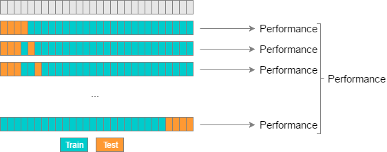

Cross-Validation
================

It's easy to train a model against a particular dataset, but how does
this model perform when introduced with new data? How do you know which
machine learning model to use? Cross-validation answers these questions
by assuring a model is producing accurate results and comparing those
results against other models. Cross-validation goes beyond regular
validation, the process of analyzing how a model does on its own
training data, by evaluating how a model does on *new* data. Several
different methods of cross-validation are discussed in the following
sections:

Holdout Method
--------------

The holdout cross-validation method involves removing a certain portion
of the training data and using it as test data. The model is first
trained against the training set, then asked to predict output from the
testing set. This is the simplest form of cross-validation techniques,
and is useful if you have a large amount of data or need to implement
validation quickly and easily.

.. figure:: _img/holdout.png
   :scale: 75 %
   :alt: holdout method

Typically the holdout method involves splitting a dataset into 20-30%
test data and the rest as training data. These numbers can vary - a
larger percentage of test data will make your model more prone to errors
as it has less training experience, while a smaller percentage of test
data may give your model an unwanted bias towards the training data.
This lack of training or bias can lead to
`Underfitting/Overfitting`_ of our model.

.. _Underfitting/Overfitting: https://machine-learning-course.readthedocs.io/en/latest/content/overview/overfitting.html

K-Fold Cross Validation
-----------------------

K-Fold Cross Validation helps remove these biases from your model by
repeating the holdout method on k subsets of your dataset. With K-Fold
Cross Validation, a dataset is broken up into several unique folds of
test and training data. The holdout method is performed using each
combination of data, and the results are averaged to find a total error
estimation.

.. figure:: _img/kfold.png
   :scale: 75 %
   :alt: kfold method

A "fold" here is a unique section of test data. For instance, if you
have 100 data points and use 10 folds, each fold contains 10 test
points. K-Fold Cross Validation is important because it allows you to
use your complete dataset for both training and testing. It's especially
useful when evaluating a model using small or limited datasets.

.. _leave-p-out--leave-one-out-cross-validation:

Leave-P-Out / Leave-One-Out Cross Validation
--------------------------------------------

Leave-P-Out Cross Validation (LPOCV) tests a model by using every
possible combination of P test data points on a model. As a simple
example, if you have 4 data points and use 2 test points, the model will
be trained and tested as follows:

::

    1: [ T T - - ]
    2: [ T - T - ]
    3: [ T - - T ]
    4: [ - T T - ]
    5: [ - T - T ]
    6: [ - - T T ]

Where "T" is a test point, and "-" is a training point. Below is another
visualization of LPOCV:

   Ref: http://www.ebc.cat/2017/01/31/cross-validation-strategies/

LPOCV can provide an extremely accurate error estimation, but can
quickly become exhaustive for large datasets. The amount of testing
iterations a model has to go through using LPOCV can be calculated using
a mathematical `combination`_ n C P, with n being our total number of
data points. We can see, for instance, that a LPOCV run using a dataset
of 10 points with 3 test points would require 10 C 3 = 120 iterations.

Because of this, Leave-One-Out Cross Validation (LOOCV) is a commonly
used cross-validation method. It is just a subset of LPOCV, with P being
1. This allows us to evaluate a model in the same number of steps as
there are data points. LOOCV can also be seen as K-Fold Cross
Validation, where the number of folds is equal to the number of data
points.

.. figure:: _img/LOOCV.png
   :scale: 75 %
   :alt: kfold method

   Ref: http://www.ebc.cat/2017/01/31/cross-validation-strategies/

Similar to K-Fold Cross Validation, LPOCV and LOOCV train a model using
the full dataset. They are particularly useful when you're working with
a small dataset, but incur performance tradeoffs.

.. _combination: https://en.wikipedia.org/wiki/Combination

.. |LPOCV| image:: http://www.ebc.cat/wp-content/uploads/2017/01/leave_p_out.png
.. |LOOCV| image:: http://www.ebc.cat/wp-content/uploads/2017/01/leave_one_out.png

Conclusion
----------

Cross-validation is a way to validate your model against new data. The
most effective forms of cross-validation involve repeatedly testing
a model against a dataset until every point or combination of points
have been used to validate a model, though this comes with performance
trade-offs. We discussed several methods of splitting a dataset for
cross-validation:

- Holdout Method: Splitting a percent of data off as test data
- K-Fold Method: Dividing data into sections, using each as a test/train split
- Leave-P-Out Method: Using every combination of a number of points (P) as test data

Motivation
----------

There are many different types of machine learning models, including
Linear/Logistic Regression, K-Nearest-Neighbors, and Support Vector
Machines - but how do we know which type of model is the best for our
dataset? Using a model unsuitable for our data will lead to less accurate
predictions, and could lead to financial, physical, or other forms of harm.
Individuals and companies should make sure to cross-validate any models
they put into use.

Code Examples
-------------

The provided code shows how to split a set of data with the three
discussed methods of cross-validation using `Scikit-Learn`_, a Python machine
learning library.

.. _Scikit-Learn: https://scikit-learn.org

`holdout.py`_ splits a set of sample diabetes data using the Holdout Method.
In scikit-learn, this is done using a function called `train_test_split()`
which randomly splits a set of data into two portions:

.. code:: python 

    TRAIN_SPLIT = 0.7
    ...

    dataset = datasets.load_diabetes()
    ...

    x_train, x_test, y_train, y_test = train_test_split(...)

Note that you can change the portion of data used for training by changing
the `TRAIN_SPLIT` value at the top. This should be a number from 0 to 1.
Output from this file shows the number of training and test points used
for the split. It may be beneficial to see the actual data points - if you
would like to see these, uncomment the last two print statements in the script.

----

`k-fold.py`_ splits a set of data using the K-Fold Method. This is done by
creating a KFold object initialized with the number of splits to use.
Scikit-learn makes it easy to split data by calling KFold's `split()` method:

.. code:: python

    NUM_SPLITS = 3
    data = numpy.array([[1, 2], [3, 4], [5, 6], [7, 8], [9, 10], [11, 12]])

    kfold = KFold(n_splits=NUM_SPLITS)
    split_data = kfold.split(data)

The return value of this is an array of train and test points. Note that
you can play with the number of splits by changing the associated value
at the top of the script. This script not only outputs the train/test data,
but also outputs a nice bar where where you can track the progress of the
current fold:

::

    [ T T - - - - ]
    Train: (2: [5 6]) (3: [7 8]) (4: [ 9 10]) (5: [11 12]) 
    Test:  (0: [1 2]) (1: [3 4])
    ...

----

`leave-p-out.py`_ splits a set of data using both the Leave-P-Out and
Leave-One-Out Methods. This is done by creating LeavePOut/LeaveOneOut objects,
the LPO initialized with the number of splits to use. Similar to KFold, the
train-test data split is created with the `split()` method:

.. code:: python

    P_VAL = 2
    data = numpy.array([[1, 2], [3, 4], [5, 6], [7, 8]])

    loocv = LeaveOneOut()
    lpocv = LeavePOut(p=P_VAL)

    split_loocv = loocv.split(data)
    split_lpocv = lpocv.split(data)

Note that you can change the P value at the top of the script to see
how different values operate.

.. _holdout.py: /https://github.com/machinelearningmindset/machine-learning-course/tree/mastercode/overview/cross-validation/holdout.py
.. _k-fold.py: /https://github.com/machinelearningmindset/machine-learning-course/tree/mastercode/overview/cross-validation/k-fold.py
.. _leave-p-out.py: /https://github.com/machinelearningmindset/machine-learning-course/tree/mastercode/overview/cross-validation/leave-p-out.py

************
References
************

1. https://towardsdatascience.com/cross-validation-in-machine-learning-72924a69872f
2. https://machinelearningmastery.com/k-fold-cross-validation/
3. https://www.quora.com/What-is-cross-validation-in-machine-learning 
#. http://www.ebc.cat/2017/01/31/cross-validation-strategies/ 

