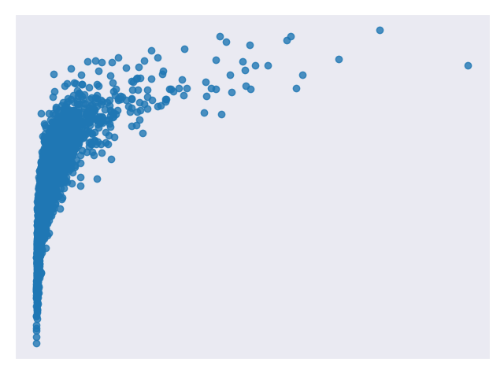
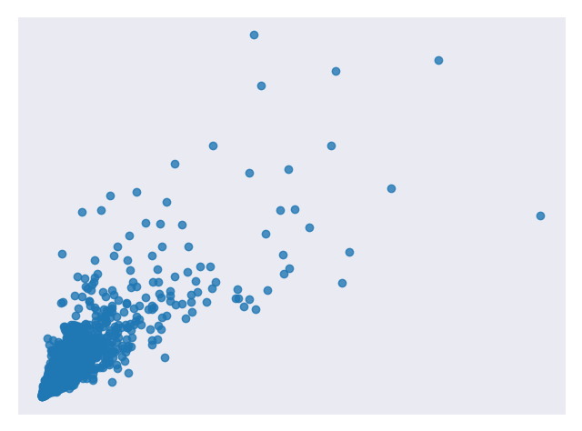
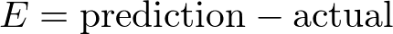
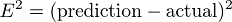
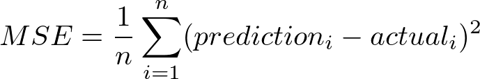

#################
Linear Regression
#################

.. contents::
  :local:
  :depth: 3

**********
Motivation
**********
When we are presented with a data set, we try and figure out what it means. 
We look for connections between the data points and see if we can find 
any patterns. Sometimes those patterns are hard to see so we use code to help 
us find them. There are lots of different patterns data can follow so it helps 
if we can narrow down those options and write less code to analyze them. One 
of those patterns is a linear relationship. If we can find this pattern in our 
data, we can use the linear regression technique to analyze it.

********
Overview
********
**Linear regression** is a technique used to analyze a **linear relationship** 
between **input** variables and a single **output** variable. A **linear 
relationship** means that the data points tend to follow a straight line. 
**Simple linear regression** involves only a single input variable. *Figure 1* 
shows a data set with a linear relationship.

.. figure:: _img/LR.png
   
   **Figure 1. A sample data set with a linear relationship** [`code`__]
   
   .. __: https://github.com/machinelearningmindset/machine-learning-course/blob/master/code/overview/linear_regression/linear_regression.py

Our goal is to find the line that best models the path of the data points 
called a line of best fit. The equation in *Equation 1*, is an example of a
linear equation.

.. figure:: _img/Linear_Equation.png
   
   **Equation 1. A linear equation**

*Figure 2* shows the data set we use in *Figure 1* with a line of best fit
through it.

.. figure:: _img/LR_LOBF.png
   
   **Figure 2. The data set from Figure 1 with a line of best fit** [`code`__]
   
   .. __: https://github.com/machinelearningmindset/machine-learning-course/blob/master/code/overview/linear_regression/linear_regression_lobf.py

Let’s break it down. We already know that x is the input value and y is our 
predicted output. a₀ and a₁ describe the shape of our line. a₀ is called the 
**bias** and a₁ is called a **weight**. Changing a₀ will move the line up or 
down on the plot and changing a₁ changes the slope of the line. Linear 
regression helps us pick appropriate values for a₀ and a₁.

Note that we could have more than one input variable. In this case, we call it 
**multiple linear regression**. Adding extra input variables just means that 
we’ll need to find more weights. For this exercise, we will only consider a 
simple linear regression.

***********
When to Use
***********
Linear regression is a useful technique but isn’t always the right choice for 
your data. Linear regression is a good choice when there is a linear 
relationship between your independent and dependent variables and you are 
trying to predict continuous values [*Figure 1*].

It is not a good choice when the relationship between independent and 
dependent variables is more complicated or when outputs are discrete values. 
For example, *Figure 3* shows a data set that does not have a linear 
relationship so linear regression would not be a good choice. 

.. figure:: _img/Not_Linear.png
   
   **Figure3. A sample data set without a linear relationship** [`code`__]
   
   .. __: https://github.com/machinelearningmindset/machine-learning-course/blob/master/code/overview/linear_regression/not_linear_regression.py

It is worth noting that sometimes you can apply transformations to data so 
that it appears to be linear. For example, you could apply a logarithm to 
exponential data to flatten it out. Then you can use linear regression on the 
transformed data. One method of transforming data in :code:`sklearn` is 
documented here_.

.. _here: https://scikit-learn.org/stable/modules/generated/sklearn.compose.TransformedTargetRegressor.html

*Figure 4* is an example of data that does not look linear but can be 
transformed to have a linear relationship.

   
   **Figure 4. A sample data set that follows an exponential curve** [`code`__]
   
   .. __: https://github.com/machinelearningmindset/machine-learning-course/blob/master/code/overview/linear_regression/exponential_regression.py

*Figure 5* is the same data after transforming the output variable with a 
logarithm.

   
   **Figure 5. The data set from Figure 4 after applying a logarithm to the 
   output variable** [`code`__]
   
   .. __: https://github.com/machinelearningmindset/machine-learning-course/blob/master/code/overview/linear_regression/exponential_regression_transformed.py

*************
Cost Function
*************
Once we have a prediction, we need some way to tell if it’s reasonable. A 
**cost function** helps us do this. The cost function compares all the 
predictions against their actual values and provides us with a single number 
that we can use to score the prediction function. *Figure 6* shows the cost 
for one such prediction.

.. figure:: _img/Cost.png
   
   **Figure 6. The plot from Figure 2 with the cost of one prediction 
   emphasized** [`code`__]
   
   .. __: https://github.com/machinelearningmindset/machine-learning-course/blob/master/code/overview/linear_regression/linear_regression_cost.py

Two common terms that appear in cost functions are the **error** and 
**squared error**. The error [*Equation 2*] is how far away from the actual 
value our prediction is.

   
   **Equation 2. An example error function**

Squaring this value gives us a useful expression for the general error 
distance as shown in *Equation 3*.

   
   **Equation 3. An example squared error function**

We know an error of 2 above the actual value and an error of 2 below the 
actual value should be about as bad as each other. The squared error makes 
this clear because both of these values result in a squared error of 4.

We will use the Mean Squared Error (MSE) function shown in *Equation 4* as our 
cost function. This function finds the average squared error value for all of 
our data points.

   
   **Equation 4. The Mean Squared Error (MSE) function**

Cost functions are important to us because they measure how accurate our model 
is against the target values. Making sure our models are accurate will remain 
a key theme throughout later modules.

*******
Methods
*******
A lower cost function means a lower average error across the data points. In 
other words, lower cost means a more accurate model for the data set. We will 
briefly mention a couple of methods for minimizing the cost function.

Ordinary Least Squares
======================
Ordinary least squares is a common method for minimizing the cost function. In 
this method, we treat the data as one big matrix and use linear algebra to 
estimate the optimal values of the coefficients in our linear equation. 
Luckily, you don't have to worry about doing any linear algebra because the 
Python code handles it for you. This also happens to be the method used for 
this modules code.

Below are the relevant lines of Python code from this module related to 
ordinary least squares.

.. code-block:: python

   # Create a linear regression object
   regr = linear_model.LinearRegression()

Gradient Descent
================
Gradient descent is an iterative method of guessing the coefficients of our 
linear equation in order to minimize the cost function. The name comes from 
the concept of gradients in calculus. Basically this method will slightly move 
the values of the coefficients and monitor whether the cost decreases or not. 
If the cost keeps increasing over several iterations, we stop because we've 
probably hit the minimum already. The number of iterations and tolerance 
before stopping can both be chosen to fine tune the method.

Below are the relevant lines of Python code from this module modified to use 
gradient descent.

.. code-block:: python

   # Create a linear regression object
   regr = linear_model.SGDRegressor(max_iter=10000, tol=0.001)

****
Code
****
This module's main code is available in the linear_regression_lobf.py_ file.

.. _linear_regression_lobf.py: https://github.com/machinelearningmindset/machine-learning-course/blob/master/code/overview/linear_regression/linear_regression_lobf.py

All figures in this module were created with simple modifications of the 
linear_regression.py_ code.

.. _linear_regression.py: https://github.com/machinelearningmindset/machine-learning-course/blob/master/code/overview/linear_regression/linear_regression.py

In the code, we analyze a data set with a linear relationship. We split the 
data into a training set to train our model and a testing set to test its 
accuracy. You may have guessed that the model used is based on linear 
regression. We also display a nice plot of the data with a line of best fit.

**********
Conclusion
**********
In this module, we learned about linear regression. This technique helps us 
model data with linear relationships. Linear relationships are fairly simple 
but still show up in a lot of data sets so this is a good technique to know. 
Learning about linear regression is a good first step towards learning more 
complicated analysis techniques. We will build on a lot of the concepts 
covered here in later modules.

************
Refrences
************

1. https://towardsdatascience.com/introduction-to-machine-learning-algorithms-linear-regression-14c4e325882a
2. https://machinelearningmastery.com/linear-regression-for-machine-learning/
3. https://ml-cheatsheet.readthedocs.io/en/latest/linear_regression.html
#. https://machinelearningmastery.com/implement-simple-linear-regression-scratch-python/
#. https://medium.com/analytics-vidhya/linear-regression-in-python-from-scratch-24db98184276
#. https://scikit-learn.org/stable/auto_examples/linear_model/plot_ols.html
#. https://scikit-learn.org/stable/modules/generated/sklearn.compose.TransformedTargetRegressor.html

