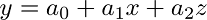

#################
Linear Regression
#################

.. contents::
  :local:
  :depth: 3

********
Overview
********
**Linear regression** is a technique used to analyze a **linear relationship** between **input/independent/x** variables and a single **output/dependent/y** variable. A **linear relationship** means that the data points tend to follow a straight line. **Simple linear regression** involves only a single input variable.

.. image:: _img/LR.png

Our goal is to find the line that best models the path of the data points called a line of best fit [*Equation 1*].

*Equation 1*:

.. image:: _img/Linear_Equation.png

.. image:: _img/LR_LOBF.png

Let’s break it down. We already know that x is the input value and y is our predicted output. a₀ and a₁ describe the shape of our line. a₀ is called the **bias** and a₁ is called a **weight**. Changing a₀ will move the line up or down on the plot and changing a₁ changes the slope of the line. Linear regression helps us pick appropriate values for a₀ and a₁.

Note that we could have more than one input variable. In this case, we call it **multiple linear regression**. Let’s add another input variable called z.

.. image:: _img/MLR.png

Then the equation changes to a plane [*Equation 2*].

*Equation 2*:

.. image:: _img/MLR_POBF.png

Adding extra input variables just means that we’ll need to find more weights. For this exercise, we will only consider a simple linear regression.

***********
When to Use
***********
Linear regression is a useful technique but isn’t always the right choice for your data. Linear regression is a good choice when there is a linear relationship between your independent and dependent variables and you are trying to predict continuous values.

.. image:: _img/LR.png

It is not a good choice when the relationship between independent and dependent variables is more complicated or when outputs are discrete values.

.. image:: _img/Not_Linear.png

It is worth noting that sometimes you can apply transformations to data so that it appears to be linear. For example, you could apply a logarithm to exponential data. Then you can use linear regression on the transformed data.

Here is an example of data that does not look linear.

.. image:: _img/Exponential.png

Here is the same data after transforming the output variable.

.. image:: _img/Exponential_Transformed.png

*************
Cost Function
*************
Once we have a prediction, we need some way to tell if it’s reasonable. A **cost function** helps us do this. The cost function compares all the predictions against their actual values and provides us with a single number that we can use to score the prediction function.

.. image:: _img/Cost.png

Two common terms that appear in cost functions are the **error** and **squared error**. The error [*Equation 3*] is how far away from the actual value our prediction is. Squaring this value gives us a useful expression for the general error distance [*Equation 4*]. We know an error of 2 above the actual value and an error of 2 below the actual value should be about as bad as each other. The squared error makes this clear because both of these values result in a squared error of 4.

*Equation 3*:

.. image:: _img/Error_Function.png

*Equation 4*:

.. image:: _img/Square_Error_Function.png

We will use the Mean Squared Error (MSE) function [*Equation 5*] as our cost function. This function finds the average squared error value for all of our data points.

*Equation 5*:

.. image:: _img/MSE_Function.png

Cost functions are important to us because they measure how accurate our model is against the target values. Making sure our models are accurate will remain a key theme throughout later modules.

*******
Methods
*******
A lower cost function means a lower average error across the data points. In other words, lower cost means a more accurate model for the dataset. We will briefly mention a couple of methods for minimizing the cost function.

======================
Ordinary Least Squares
======================
Ordinary least squares is a common method for minimizing the cost function. In this method, we treat the data as one big matrix and use linear algebra to estimate the optimal values of the coefficients in our linear equation. Luckily, you don't have to worry about doing any linear algebra because the Python code handles it for you. This also happens to be the method used for this modules code.

Below are the relevant lines of Python code from this module related to ordinary least squares.

.. code-block:: python

   # Create a linear regression object
   regr = linear_model.LinearRegression()

================
Gradient Descent
================
Gradient descent is an iterative method of guessing the coefficients of our linear equation in order to minimize the cost function. The name comes from the concept of gradients in calculus. Basically this method will slightly move the values of the coefficients and monitor whether the cost decreases or not. If the cost keeps increasing over several iterations, we stop because we've probably hit the minimum already. The number of iterations and tolerance before stopping can both be chosen to fine tune the method.

Below are the relevant lines of Python code from this module modified to use gradient descent.

.. code-block:: python

   # Create a linear regression object
   regr = linear_model.SGDRegressor(max_iter=10000, tol=0.001)

*******
Summary
*******
Linear regression is a technique used to analyze a linear relationship between input variables and a single output variable. We measure how accurate the resulting model is using a cost function. We want to minimize the value of the cost function in order to get a more accurate model.
