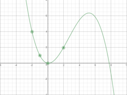
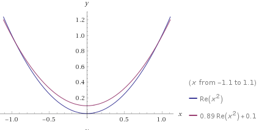

================================
Overfitting and Underfitting
================================

.. contents::
  :local:
  :depth: 3

----------------------------
Overview
----------------------------
When using machine learning, there are many ways to go wrong.
Some of the most common issues in machine learning are **overfitting** and **underfitting**.
To understand these concepts, let's imagine a machine learning model that is
trying to learn to classify numbers, and has access to a training set of data and a testing set of data.

----------------------------
Overfitting
----------------------------

A model suffers from **Overfitting** when it has learned too much from the
training data, and does not perform well in practice as a result.
This is usually caused by the model having too much exposure to the training data.
For the number classification example, if the model is overfit in this way, it
may be picking up on tiny details that are misleading, like stray marks as an indication of a specific number.

The estimate looks pretty good when you look at the middle of the graph, but the edges have large error.
In practice, this error isn't always at edge cases and can pop up anywhere.
The noise in training can cause error as seen in the graph below.

(Created using https://www.desmos.com/calculator/dffnj2jbow)

In this example, the data is overfit by a polynomial degree.
The points indicated are true to the function y = x^2, but does not approximate the function well outside of those points.

----------------------------
Underfitting
----------------------------

A model suffers from **Underfitting** when it has not learned enough from the
training data, and does not perform well in practice as a result.
As a direct contrast to the previous idea, this issue is caused by not letting
the model learn enough from training data.
In the number classification example, if the training set is too small or the
model has not had enough attempts to learn from it, then it will not be able to pick out key features of the numbers.

The issue with this estimate is clear to the human eye, the model should be
nonlinear, and is instead just a simple line.
In machine learning, this could be a result of underfitting, the model has not
had enough exposure to training data to adapt to it, and is currently in a simple state.

.. figure:: _img/Underfit.PNG
   :scale: 100 %
   :alt: Underfit
(Created using Wolfram Alpha)

----------------------------
Motivation
----------------------------

Finding a good fit is one of the central problems in machine learning.
Gaining a good grasp of how to avoid fitting problems before even worrying
about specific methods can keep models on track.
The mindset of hunting for a good fit, rather than throwing more learning
time at a model is very important to have.

----------------------------
Code
----------------------------

The example code for overfitting shows some basic examples based in polynomial
interpolation, trying to find the equation of a graph.
The overfitting.py_ file, you can see that there is a true function being
modeled, as well as some estimates that are shown to not be accurate.

.. _overfitting.py: https://github.com/machinelearningmindset/machine-learning-course/blob/master/code/overview/overfitting/overfitting.py

The estimates are representations of overfitting and underfitting.
For overfitting, a higher degree polynomial is used (x cubed instead of squared).
While the data is relatively close for the chosen points, there are some artifacts outside of them.
The example of underfitting, however, does not even achieve accuracy at many of the points.
Underfitting is similar to having a linear model when trying to model a quadratic function.
The model does well on the point(s) it trained on, in this case the point used
for the linear estimate, but poorly otherwise.

----------------------------
Conclusion
----------------------------

Check out the cross-validation and regularization sections for information on
how to avoid overfitting in machine learning models.
Ideally, a good fit looks something like this:

(Created using Wolfram Alpha)

When using machine learning in any capacity, issues such as overfitting
frequently come up, and having a grasp of the concept is very important.
The modules in this section are among the most important in the whole repository,
since regardless of the implementation, machine learning always includes these fundamentals.
