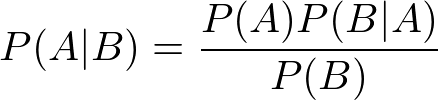

##########################
Naive Bayes Classification
##########################

.. contents::
  :local:
  :depth: 3

**********
Motivation
**********
A recurring problem in machine learning is the need to classify input into
some preexisting class. Consider the following example.

Say we want to classify a random piece of fruit we found lying around. In this
example, we have three existing fruit categories: apple, blueberry, and
coconut. Each of these fruits have three features we care about: size, weight,
and color. This information is shown in *Figure 1*.

.. csv-table:: **Figure 1. A table of fruit characteristics**
   :header: "", "Apple", "Blueberry", "Coconut"
   :stub-columns: 1

   "Size", "Moderate", "Small", "Large"
   "Weight", "Moderate", "Light", "Heavy"
   "Color", "Red", "Blue", "Brown"

We observe the piece of fruit we found and determine it has a moderate size,
it is heavy, and it is red. We can compare these features against the features
of our known classes to guess what type of fruit it is. The unknown fruit is
heavy like a coconut but it shares more features with the apple class. The
unknown fruit shares 2 of 3 characteristics with the apple class so we guess
that it’s an apple. We used the fact that the random fruit is moderately sized
and red like an apple to make our guess.

This example is a bit silly but it highlights some fundamental points about
classification problems. In these types of problems, we are comparing features
of an unknown input to features of known classes in our data set. Naive Bayes
classification is one way to do this.

***********
What is it?
***********
Naive Bayes is a classification technique that uses probabilities we already
know to determine how to classify input. These probabilities are related to
existing classes and what features they have. In the example above, we choose
the class that most resembles our input, apple, as its classification. This
technique is based around using Bayes’ Theorem. If you’re unfamiliar with what
Bayes’ Theorem is, don’t worry! We will explain it in the next section.

**************
Bayes’ Theorem
**************
Bayes’ Theorem [*Equation 1*] is a very useful result that shows up in
probability theory and other disciplines.

   **Equation 1. Bayes' Theorem**

With Bayes’ Theorem, we can examine conditional probabilities (the probability
of an event happening given another event has happened). P(A|B) is the
probability that event A will happen given that event B has already happened.
We can determine this value using other information we know about events A and
B. We need to know P(B|A) (the probability that event B will happen given that
event A has already happened), P(B) (the probability event B will happen), and
P(A) (the probability event A will happen). We can even apply Bayes’ Theorem
to machine learning problems!

***********
Naive Bayes
***********
Naive Bayes classification uses Bayes’ Theorem with some additional
assumptions. The main thing we will assume is that features are independent.
Assuming independence means that the probability of a set of features
occurring given a certain class is the same as the product of all the
probabilities of each individual feature occurring given that class. In the
case of our fruit example above, being red does not affect the probability of
being moderately sized so assuming independence between color and size is
fine. This is often not the case in real-world problems where features may
have complex relationships. This is why “naive” is in the name. If the math
seems complicated, don’t worry! The code will handle the number crunching for
us. Just remember that we are assuming that features are independent of each
other to simplify calculations.

In this technique, we take some input and calculate the probability of it
happening given that it belongs to one of our classes. We must do this for
**each** of our classes. After we have all these probabilities, we just take
the one that’s the largest as our prediction for what class the input belongs
to.

**********
Algorithms
**********
Below are some common models used for Naive Bayes classification. We have
separated them into two general cases based on what type of feature
distributions they use: continuous or discrete. Continuous means real-valued
(you can have decimal answers) and discrete means a count (you can only have
whole number answers). Also provided are the relevant code snippets for each
algorithm.

Gaussian Model (Continuous)
===========================
Gaussian models assume features follow a normal distribution. As far as you
need to know, a normal distribution is just a specific type of distribution.
This is another big assumption because many features do not follow a normal
distribution. While this is true, assuming a normal distribution makes our
calculations a whole lot easier. We use Gaussian models when features are not
counts and include decimal values.

The relevant code is available in the gaussian.py_ file.

.. _gaussian.py: /code/supervised/naive_bayes/gaussian.py

In the code, we try and guess a color from given RGB percentages. We create
some data to work with where each data point represents an RGB triple. The
values of the triples are decimals ranging from 0 to 1 and each has a color
class it is associated with. We create a Gaussian model and fit it to the
data. We then make a prediction with new input to see which color it should be
classified as.

Multinomial Model (Discrete)
============================
Multinomial models are used when we are working with discrete counts.
Specifically, we want to use them when we are counting how often a feature
occurs. For example, we might want to count how often the word “count” appears
on this page.

The relevant code is available in the multinomial.py_ file.

.. _multinomial.py: /code/supervised/naive_bayes/multinomial.py

The code is based on our fruit example. In the code, we try and guess a fruit
from given characteristics. We create some data to work with where each data
point is a triple representing characteristics of a fruit namely size, weight,
and color. The values of the triples are integers ranging from 0 to 2 and each
has a fruit class it is associated with. The integers are basically just
labels associated with characteristics but using them instead of strings
allows us to use a Multinomial model. We create a Multinomial model and fit it
to the data. We then make a prediction with new input to see which fruit it
should be classified as.

Bernoulli Model (Discrete)
==========================
Bernoulli models are also used when we are working with discrete counts.
Unlike the multinomial case, here we are counting whether or not a feature
occurred. For example, we might want to check if the word “count” appears at
all on this page. We can also use Bernoulli models when features only have 2
possible values like red or blue.

The relevant code is available in the bernoulli.py_ file.

.. _bernoulli.py: /code/supervised/naive_bayes/bernoulli.py

In the code, we try and guess if something is a duck or not based on certain
characteristics it has. We create some data to work with where each data point
is a triple representing the characteristics: walks like a duck, talks like a
duck, and is small. The values of the triples are either 1 or 0 for true or
false and each is either a duck or not a duck. We create a Bernoulli model and
fit it to the data. We then make a prediction with new input to see whether or
not it is a duck.

**********
Conclusion
**********
In this module, we learned about Naive Bayes classification. Naive Bayes
classification lets us classify an input based on probabilities of existing
classes and features. As demonstrated in the code, you don’t need a lot of
training data for Naive Bayes to be useful. Another bonus is speed which can
come in handy for real-time predictions. We make a lot of assumptions to use
Naive Bayes so results should be taken with a grain of salt. But if you don’t
have much data and need fast results, Naive Bayes is a good choice for
classification problems.
