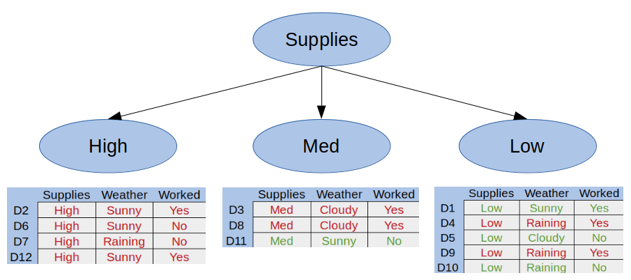
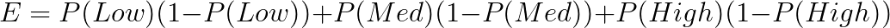

Decision Trees
==============

.. contents::
  :local:
  :depth: 2

Decision trees are a classifier in machine learning that allows us to
make predictions based on previous data. They are like a series of
sequential “if … then” statements you feed new data into to get a
result.

To demonstrate decision trees, let’s take a look at an example. Imagine
we want to predict whether Mike is going to go grocery shopping on any
given day. We can look at previous factors that led Mike to go to the
store:

.. figure:: _img/shopping_table.png
   :alt: Dataset

   Dataset

Here we can see the amount of grocery supplies Mike had, the weather,
and whether Mike worked each day. Green rows are days he went to the
store, and red days are those he didn’t. The goal of a decision tree is
to try to understand *why* Mike goes to the store, and apply that to new
data later on.

Let’s divide the first attribute up into a tree. Mike can either have a
low, medium, or high amount of supplies:

   Tree 1

Here we can see that Mike never goes to the store if he has a high
amount of supplies. This is called a **pure subset**, a subset with only
positive or only negative examples. With decision trees, there is no
need to break a pure subset down further.

Let’s break the Med Supplies category into whether Mike worked that day:

.. figure:: _img/decision_tree_2.png
   :alt: Tree 2

   Tree 2

Here we can see we have two more pure subsets, so this tree is complete.
We can replace any pure subsets with their respective answer - in this
case, yes or no.

Finally, let’s split the Low Supplies category by the Weather attribute:

.. figure:: _img/decision_tree_3.png
   :alt: Tree 3

   Tree 3

Now that we have all pure subsets, we can create our final decision
tree:

.. figure:: _img/decision_tree_4.png
   :alt: Tree 4

   Tree 4

Classification and Regression Trees
-----------------------------------

Decision tree algorithms are also known as CART, or Classification and
Regression Trees. A **Classification Tree**, like the one shown above,
is used to get a result from a set of possible values. A **Regression
Tree** is a decision tree where the result is a continuous value, such
as the price of a car.

Splitting
---------

Decision trees are created through a process of splitting, but how do we
create the tree? We need a recursive algorithm that determines the best
attributes to split on. One such algorithm is the **greedy algorithm**:

1. Starting from the root, we create a split for each attribute.
2. For each created split, calculate the cost of the split.
3. Choose the split that costs the least.
4. Recurse into the sub-trees and continue from step 1.

This process is repeated until all nodes have the same value as the
target result, or splitting adds no value to a prediction. This
algorithm has the root node as the best classifier.

Cost of Splitting
~~~~~~~~~~~~~~~~~

The cost of a split is determined by a **cost function**. The goal of
using a cost function is to split the data in a way that can be computed
and that provides the most information gain. For classification trees,
those that provide an answer rather than a value, we use the
*Gini Index Function*:

.. figure:: _img/Gini.png

    **Equation 1. The Gini Index Function**
    Ref: https://towardsdatascience.com/a-guide-to-decision-trees-for-machine-learning-and-data-science-fe2607241956

The Gini Index Function gives us a measure of Gini Impurity, the
likelihood of an incorrect classification of new data. For example,
let's take a look at the example data we used earlier:

+-----+----------+----------+----------+----------+
|     | Supplies | Weather  | Worked?  | Shopped? |
+=====+==========+==========+==========+==========+
| D1  | Low      | Sunny    | Yes      | Yes      |
+-----+----------+----------+----------+----------+
| D2  | High     | Sunny    | Yes      | No       |
+-----+----------+----------+----------+----------+
| D3  | Med      | Cloudy   | Yes      | No       |
+-----+----------+----------+----------+----------+
| D4  | Low      | Raining  | Yes      | No       |
+-----+----------+----------+----------+----------+
| D5  | Low      | Cloudy   | No       | Yes      |
+-----+----------+----------+----------+----------+
| D6  | High     | Sunny    | No       | No       |
+-----+----------+----------+----------+----------+
| D7  | High     | Raining  | No       | No       |
+-----+----------+----------+----------+----------+
| D8  | Med      | Cloudy   | Yes      | No       |
+-----+----------+----------+----------+----------+
| D9  | Low      | Raining  | Yes      | No       |
+-----+----------+----------+----------+----------+
| D10 | Low      | Raining  | No       | Yes      |
+-----+----------+----------+----------+----------+
| D11 | Med      | Sunny    | No       | Yes      |
+-----+----------+----------+----------+----------+
| D12 | High     | Sunny    | Yes      | No       |
+-----+----------+----------+----------+----------+

Let's calculate the Gini Index of the first class, Supplies.
To do this, we take each available option and calculate the
probability of our outcome based off of it. For instance, Mike
went shopping on 3 out of 5 days when he had low supplies. This
gives us P(Low) = 3/5.

We continue this pattern for every option in the class and plug
the probabilities into our cost function:

Pruning
-------

TODO

Reduced Error
~~~~~~~~~~~~~

TODO

Complexity / Weakest Link
~~~~~~~~~~~~~~~~~~~~~~~~~

