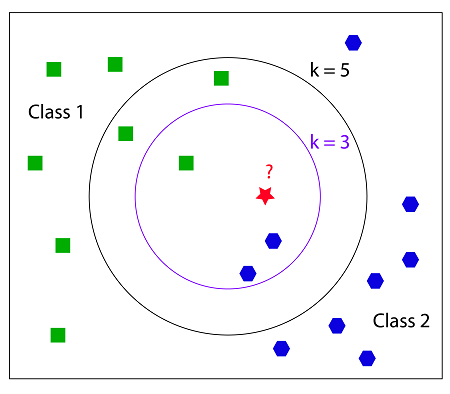
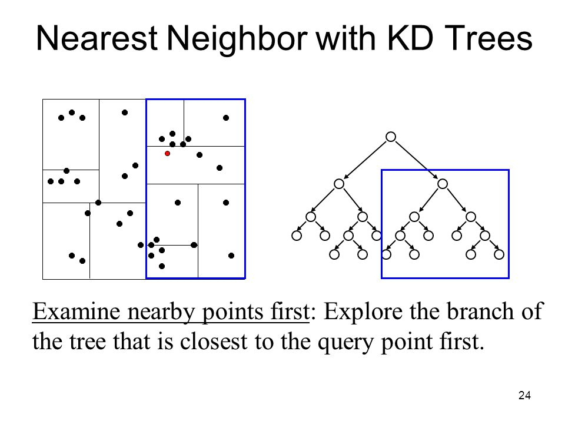

====================
k-Nearest Neighbors
====================

.. contents::
  :local:
  :depth: 3

Introduction
-------------

K-Nearest Neighbors (KNN) is a basic classifier for machine learning.
A **classifier** takes an already labeled data set, and then it trys to 
label new data points into one of the catagories. 
So, we are trying to identify what class an object is in. To do this we 
look at the closest points (neighbors) to the object and the class with 
the majority of neighbors will be the class that we identify the object 
to be in. The k is the number of nearest neighbors to the object. So, if 
k = 1 then the class the object would be in is the class of the closest 
neighbor. Let's look at an example.

   Ref: https://coxdocs.org

In this example we are trying to classify the red star to be either 
a green square or a blue octagon. First, if we look at the inner circle
where k = 3, we can see that there are 2 blue octagons and 1 green square.
So there is a majority of blue octagons, so the red star would be classified
as a blue octagon. Now we look at k = 5, the outer circle. In this one
there is 2 blue octagons and 3 green squares. Then, the red star would be 
classified as a green square.

How does it work?
-----------------

We will look at two different ways to go about this. The two ways are
the brute force method and the K-D tree method.

Brute Force Method
--------------------

This is the simplest method. Basically, it's just calculating the **Euclidean 
distance** from the object being classified to each point in the set. The Euclidean distance
is simply the length of a line segment that connects two points. The Brute Force method is
useful when the dimensions of the points are small or the number of points is small.
As the number of points increases the number of times the method will have to calculate
the Euclidean distance also increases, so the performance of the method drops. Luckily,
the K-D tree method is better equipped for larger sets of data. 

K-D Tree Method
-----------------

This method tries to improve the running time by reducing the amount of times we
calculate the Euclidean distance. The idea behind this method is that if we know
that two data points are close to each other and we calculate the Euclidean distance
to one of them and then we know that distance is roughly close to the other point. 
Here is an example of how the K-D tree looks like.

   Ref: https://slideplayer.com/slide/3273367/

How a K-D tree works is that a node in the tree represents and holds data from an n-dimensional
graph. Each node represents a box in the graph. First we can build a K-D tree out of a set of data, then 
when it's time to classify a point we would just look at where the point will fall in the 
tree then calculate the Euclidean distance between only the points it is close to until we reach 
k neighbors. 

If you have a larger data set it is recommended to use this method. This is because the cost of creating
the K-D tree is relatively low if the data set is larger, and the cost of classifiying a point is 
constant as the data gets larger. 

Choosing k
-----------

Choosing k typically depends on the dataset you are looking at. You never want to
choose k = 2 because it has a very high chance that there won't be a majority class,
so in the example above there would be one of each so we wouldn't be able to 
classify the red star. Typically, you want the value of k to be small. As k goes to 
infinity all unidentified data points will always be classified to one class or the other
depending on which class has more data points. You don't want this to happen,
so it is wise to choose a k that is relatively small.

Conclusion
------------

Here are some things to take away:

- The different methods to KNN only affect the performance, not the output
- The Brute Force Method is best when the dimensions of the points or the number of points are small
- The K-D Tree Method is best when you have a larger data set
- SKLearn KNN classifier has a auto method which decides what method to use given what data it's trained on. 

Choosing the value of k will drastically change how the data is classified. A higher k value will ignore outliers to the data 
and a lower will give more weight to them. If the k value is too high it will not be able to classify the data, so k needs to 
be relatively small. 

Motivation
------------

So why would someone use this classifier over another? Is this the best classifier? The answer to these questions are that it depends. 
There is no classifier that is best, it all depends on the data that a classifier is given. KNN might be the best for one dataset but 
not another. It's good to know about other classifiers like `Support Vector Machines`_, and then decide which one best classifies the 
a given dataset.

Code Example
-------------

Check out our code, `knn.py`_ to learn how to implement a k nearest neighbor classifier using Python's Scikit-learn library. 
More information about Scikit-Learn can be found `here`_. 

`knn.py`_, Classifies a set of data on breast cancer, loaded from Scikit-Learn's dataset library. 
The program will take the data and plot them on a graph, then use the KNN algorithm to best separate the data. 
The output should look like this:

.. figure:: _img/knn_output_k9.png
   :scale: 50%
   :alt: KNN k = 9 output

The green points are classified as benign.
The red points are classified as malignant.
The boundary line is the prediction that the classifier makes. This boundary line is determined by the k value, for this instance
k = 9. 

This loads the data from the Scikit-Learn's dataset library. You can change the data to whatever you would like. 
Just make sure you have data points and an array of targets to classify those data points. 

.. code:: python

    dataCancer = load_breast_cancer()
    data = dataCancer.data[:, :2]
    target = dataCancer.target

You can also change the k value or n_neighbors value that will change the algorithm. It is suggested that you 
choose a k that is relatively small. 

You can also change the algorithm used, the options are 
{‘auto’, ‘ball_tree’, ‘kd_tree’, ‘brute’}. These don't change the output of the prediction, they will just 
change the time it takes to predict the data. 

Try changing the value of n_neighbors to 1 in the code below. 

.. code:: python

    model = KNeighborsClassifier(n_neighbors = 9, algorithm = 'auto')
    model.fit(data, target)

If you changed the value of n_neighbors to 1 this will classify by the point that is closest to the point. The output should look like this:

.. figure:: _img/knn_output_k1.png
   :scale: 50%
   :alt: KNN k = 1 output

Comparing this output to k = 9 you can see a large difference on how it classifies the data. So if you want to ignore outliers you
will want a higher k value, otherwise choose a smaller k like 1, 3 or 5. You can experiment by choosing a very high k greater than 100.
Eventually the algorithm will classify all the data into 1 class, and there will be no line to split the data. 

.. _here: https://scikit-learn.org

.. _knn.py: https://github.com/machinelearningmindset/machine-learning-course/blob/master/code/supervised/KNN/knn.py

.. _Support Vector Machines: linear_SVM.html

