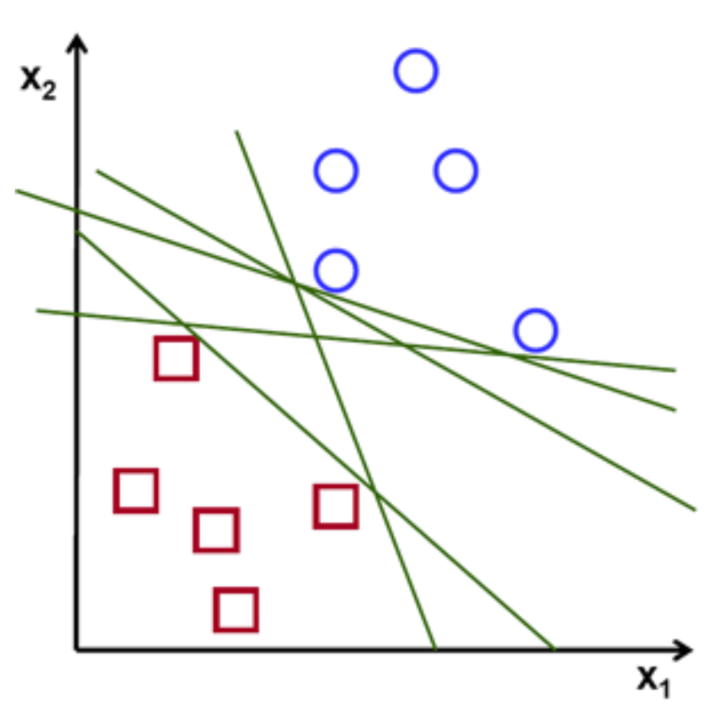
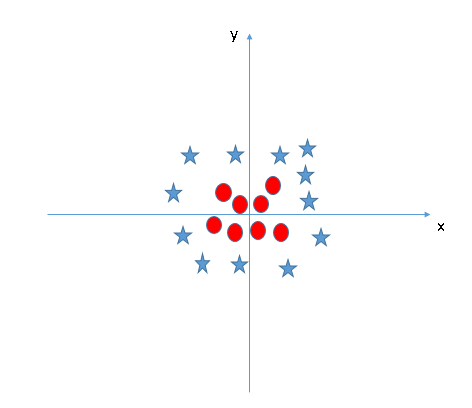

==========================
Linear Support Vector Machines
==========================

A **Support Vector Machine** (SVM for short) is another machine learning algorithm that is used to classify data. The point of SVM's are to try and find a line or hyperplane to divide a dimensional space which best classifies the data points. If we were trying to divide two classes A and B we would try best separate the two classes with a line. So on one side of the line/hyperplane would be data from class A and on the otherside would be from class B. This alogorithm is very useful in classifying because we just have to caluclate the best line or hyperplane once and any knew data points we can easily classify just by seeing which side of the line it falls on. Unlike KNN, where we would have to calculate each data points nearest neighbors.

How do we find the best hyperplane/line?
----------------------------------------

You might be wondering that there could be multiple lines that split the data well. As you can see in the graph below every line splits the squares and the circles, so which one do we choose?

   Ref: https://towardsdatascience.com/support-vector-machine-introduction-to-machine-learning-algorithms-934a444fca47

We want to choose the line/plane with the **maximum margin**. Maximizing the margin will give us the optimal line to classify the data. This is shown in the figure below.

.. figure:: _img/Optimal_hyperplane.png
   :scale: 50 %
   :alt: Optimal_Hyperplane

   Ref: https://towardsdatascience.com/support-vector-machine-introduction-to-machine-learning-algorithms-934a444fca47

How to maximize the margin?
---------------------------

The data that is closest to the line are what determmine the optimal line. These data points are called **support vectors**. They are shown as the filled in squares and circles above. There is a lot of complex math that goes into finding the support vectors and maximizing the margin. We won't go into that, we just want to get the basic idea behind SVMs.

Ignore Outliers
---------------

Sometimes data classes will have **outliers**, (data that is separated from it's class). Support Vector Machines will ignore these outliers. This is shown in the figure below.

.. figure:: _img/SVM_Outliers.png
   :scale: 50 %
   :alt: Outliers

   Ref:  https://www.analyticsvidhya.com/blog/2017/09/understaing-support-vector-machine-example-code/

The star that is with the red circles is the outlier. So the SVM ignores the outlier and creates the best line to separate the two classes.

Kernal SVM
-----------

There will be data classes that can't be separated with a simple line or hyperplane. This is called **non-linearly separable data**. Here is an example of that kind of data.

   Ref:  https://www.analyticsvidhya.com/blog/2017/09/understaing-support-vector-machine-example-code/

There's is no clear way to separate the stars from the circles. We will go over how SVMs will be able to classify non-lenearly separable data in our section about **Kernal SVM**.

Conclusion
-----------

A SVM is a great machine learning technique to classify data. The pros to SVM's are it is a great classifier when there are mulitple dimensions in the data points. It is also saves space on memory because it only uses the support vectors to create the optimal line. The cons to SVM's are that the training times are higher when there is a larger data set, so it doesn't perform well. Also it performs badly when the classes are overlapping.

Check out our code to learn how to implement a linear SVM using Python's scikit-learn library.
