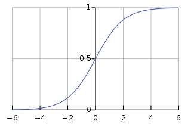

====================
Logistic Regression
====================

Introduction
-----------------

Logistic regression is a method for binary classification.  It works to divide points in a dataset into two distinct classes, or categories.
For simplicity, let's call them class A and class B.  The model will give us the probability that a given point belongs in category B.
If it is low (lower than 50%), then we classify it in category A.  Otherwise, it falls in class B.  
It's also important to note that logistic regression is better for this purpose than linear regression with a threshold 
because the threshold would have to be manually set, which is not feasible.  Logistic regression will create a sort of S-curve 
(using the sigmoid function) which will also help show certainty, since the output from logistic regression is not just a one or zero.  
Here is the standard logistic function, note that the output is always between 0 and 1, but never reaches either of those values.:

   Ref: https://en.wikipedia.org/wiki/Logistic_regression

When to use it
-----------------

Logistic Regression is great for situations where you need to classify between two categories.  
Some good examples are accepted and rejected applicants and victory or defeat in a competition.  
Here is an example table of data that would be a good candidate for logistic regression. IMAGE SOON

.. figure:: _img/Logistic_Table
   :scale: 50 %
   :alt: Logit table

How does it work?
-----------------

Logistic regression works using a linear combination of inputs, so multiple information sources can govern the output of the model.  The parameters of the model are the weights of the various features, and represent their relative importance to the result.:  

   Ref: https://en.wikipedia.org/wiki/Logistic_regression
The beta values are the weights and x values are the variable inputs.  This formula gives the probability that the input belongs to Class B, which is the output of the function.

Conclusion
-----------------

Machine learning libraries make using Logistic Regression very simple.  Check out the example code in the repository and follow along. The basic idea is to supply the training data as pairs of input and classification, and the model will be built automatically.  As always, keep in mind the basics mentioned in this repository, as there is no fool-proof method for machine learning.
