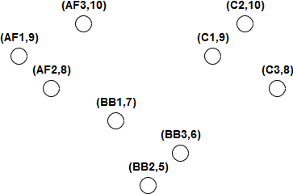
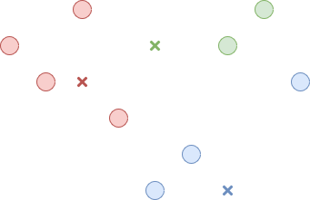
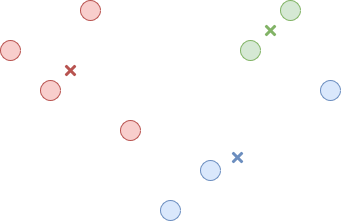
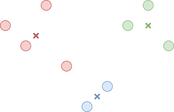
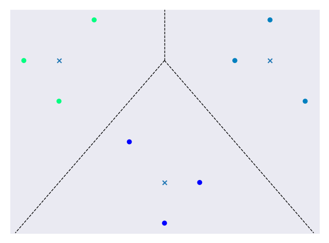
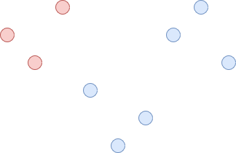
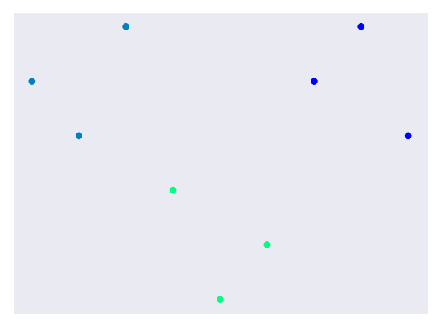

##########
Clustering
##########

.. contents::
  :local:
  :depth: 3

********
Overview
********
In previous modules, we talked about supervised learning topics. We are now
ready to move on to **unsupervised learning** where our goals will be much
different. In supervised learning, we tried to match inputs to some existing
patterns. For unsupervised learning, we will try to discover patterns in raw
data. We saw classification problems come up often in supervised learning and
we will now examine a similar problem in unsupervised learning: **clustering**.

**********
Clustering
**********
Clustering is the process of grouping similar data and isolating dissimilar
data. We want the data points in clusters we come up with to share some common
properties that separate them from data points in other clusters. Ultimately,
we’ll end up with a number of groups that meet these requirements. This
probably sounds familiar because on the surface it sounds a lot like
classification. But be aware that clustering and classification solve two very
different problems. Clustering is used to identify potential groups in a data
set while classification is used to match an input to an existing group.

**********
Motivation
**********
Clustering is a very useful technique for solving problems that commonly arise
in unsupervised learning. With clustering, we can find underlying patterns in
a data set by grouping similar data points. Consider the case of a toy
manufacturer. The toy manufacturer makes a lot of products and happens to have
a diverse consumer base. It could be useful for the manufacturer to identify
groups that buy particular products so it can personalize advertisements.
Targeted advertising is a common desire in marketing and clustering helps
identify demographics. When we want to identify potential group structures in
a raw data set, clustering is a good tool to use.

*******
Methods
*******
Because clustering just provides an interpretation of a data set, there are
many ways to go about implementing it. We might consider the distance between
data points when deciding on clusters. We could also consider how dense data
points are in a region to determine clusters. For this module, we will analyze
two of the more common and popular methods: **K-Means** and **Hierarchical**.
In both cases, we will use the data set in *Figure 1* for analysis.

   **Figure 1. A data set to use for clustering**

K-Means
=======
K-Means clustering attempts to divide a data set into K clusters using an
iterative process. The first step is choosing a center point for each cluster.
This center point does not need to correspond to an actual data point. The
second step is assigning each data point to a cluster. We do this by measuring
the distance between a data point and each center point and choosing the
cluster whose center point is the closest. This step is illustrated in
*Figure 2*.

   **Figure 2. Associate each point with a cluster**

Now that all the data points belong to a cluster, the third step is
recomputing the center point of each cluster. This is just the average of all
the data points belonging to the cluster. This step is illustrated in
*Figure 3*.

   **Figure 3. Find the new center for each cluster**

Now we just repeat the second and third step until the centers stop changing
or only change slightly between iterations. The result is K clusters where
data points are closer to their cluster’s center than any other cluster’s
center. This is illustrated in *Figure 4*.

   **Figure 4. The final clusters**

K-Means clustering requires us to input the number of expected clusters which
isn’t always easy to determine. It can also be inconsistent depending on where
we choose the starting center points in the first step. For example, *Figure
5* shows another result we may have gotten given different starting points.

.. figure:: _img/K_Means_Final_Alt.png

   **Figure 5. An alternative set of clusters**

On the other hand, K-Means is very powerful because it considers the entire
data set at each step. It is also fast because we’re only ever computing
distances. So if we want a fast technique that considers the whole data set
and we have some knowledge of what the underlying groups might look like,
K-Means is a good choice.

The relevant code is available in the clustering_kmeans.py_ file.

.. _clustering_kmeans.py: /code/unsupervised/Clustering/clustering_kmeans.py

In the code, we create the simple data set to use for analysis. Setting up the
clustering is very simple and requires one line of code:

.. code-block:: python

   kmeans = KMeans(n_clusters=3, random_state=0).fit(x)

The `n_clusters` parameter was chosen to be 3 because there appears to be 3
clusters in out data set. The `random_state` parameter is just there to give a
consistent result each time you run the code. The rest of the code is to
display the final plot shown in *Figure 6*.

   **Figure 6. A final clustered data set**

Hierarchical
============
Hierarchical clustering imagines the data set as a hierarchy of clusters. We
could start by making one giant cluster out of all the data points. This is
illustrated in *Figure 7*.

.. figure:: _img/Hierarchical_Step1.png

   **Figure 7. One giant cluster in the data set***

Inside of this cluster, we find the two least similar sub-clusters and split
them. This is illustrated in *Figure 8*.

   **Figure 8. The giant cluster is split into 2 clusters**

We continue to split the sub-clusters until every data point belongs to its
own cluster or until we decide to stop. If we start from one giant cluster and
break it down into successively smaller clusters, it is called **top-down**
clustering. Alternatively, we could start by considering a cluster for every
data point. The next step would be to combine the two closest clusters into a
larger cluster. We would continue this process until we had a single cluster.
This method of combining clusters is called **bottom-up** clustering. At any
point in these two methods, we can stop when the clusters look appropriate.

Unlike K-Means, Hierarchical clustering is relatively slow so it doesn’t scale
as well to large data sets. On the bright side, Hierarchical clustering is
more consistent when you run it multiple times and doesn’t require you to know
the number of expected clusters.

The relevant code is available in the clustering_hierarchical.py_ file.

.. _clustering_hierarchical.py: /code/unsupervised/Clustering/clustering_hierarchical.py

In the code, we create the simple data set to use for analysis. Setting up the
clustering is very simple and requires one line of code:

.. code-block:: python

   hierarchical = AgglomerativeClustering(n_clusters=3).fit(x)

The `n_clusters` parameter was chosen to be 3 because there appears to be 3
clusters in out data set. If we didn't already know this, we could try out
different values and see which one worked the best. The rest of the code is to
display the final plot shown in *Figure 9*.

   **Figure 9. A final clustered data set**

Summary
=======
In this module, we learned about clustering. Clustering allows us to discover
patterns in a raw data set by grouping similar data points. This is a common
desire in unsupervised learning and clustering is a popular technique. You may
have noticed that the methods discussed above were relatively simple compared
to some of the more math-heavy descriptions in previous modules. These methods
are simple but powerful. By developing a good understanding of clustering, you
are setting yourself up for success in the machine learning world.
