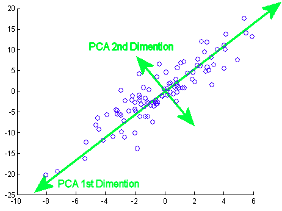
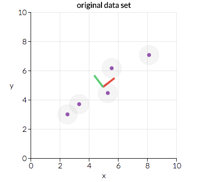
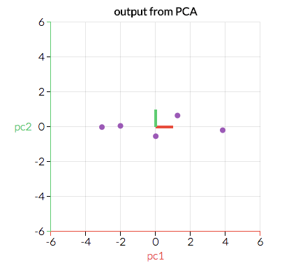
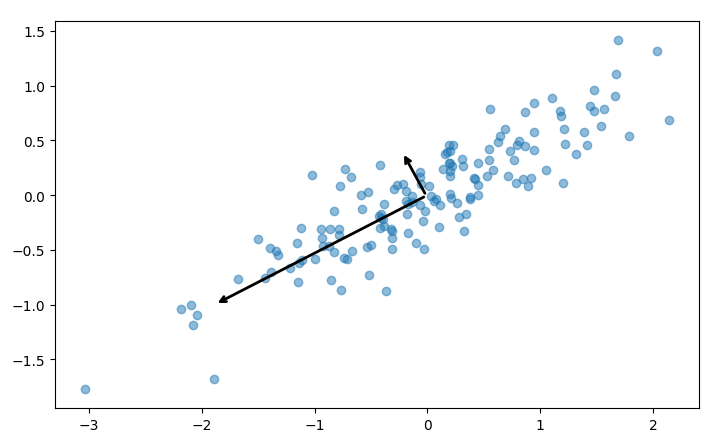

Principal Component Analysis
============================

.. contents::
  :local:
  :depth: 2

Introduction
------------

Principal component analysis is one technique used to take a large list
of interconnected variables and choose the ones that best suit a model.
This process of focusing in on only a few variables is called
**dimensionality reduction**, and helps reduce complexity of our
dataset. At its root, principal component analysis *summarizes* data.

   Ref: https://stats.stackexchange.com/questions/2691/making-sense-of-principal-component-analysis-eigenvectors-eigenvalues

Motivation
----------

Principal component analysis is extremely useful for deriving an overall,
linearly independent, trend for a given dataset with many variables.
It allows you to extract important relationships out of variables that
may or may not be related. Another application of principal component
analysis is for display - instead of representing a number of different
variables, you can create principal components for just a few and plot
them.

Dimensionality Reduction
------------------------

There are two types of dimensionality reduction: feature elimination
and feature extraction.

**Feature elimination** simply involves pruning
features from a dataset we deem unnecessary. A downside of feature
elimination is that we lose any potential information gained from the
dropped features.

**Feature extraction**, however, creates new variables
by combining existing features. At the cost of some simplicity or
interpretability, feature extraction allows you to maintain all
important information held within features.

Principal component analysis deals with feature extraction (rather than
elimination) by creating a set of independent variables called principal
components.

PCA Example
-----------

Principal component analysis is performed by considering all of our
variables and calculating a set of direction and magnitude pairs (vectors)
to represent them. For example, let's consider a small example dataset
plotted below:

   Ref: https://towardsdatascience.com/a-one-stop-shop-for-principal-component-analysis-5582fb7e0a9c

Here we can see two direction pairs, represented by the red and green
lines. In this scenario, the red line has a greater magnitude as the
points are more clustered across a greater distance than with the
green direction. Principal component analysis will use the vector
with the greater magnitude to transform the data into a smaller
feature space, reducing dimensionality. For example, the above graph
would be transformed into the following:

   Ref: https://towardsdatascience.com/a-one-stop-shop-for-principal-component-analysis-5582fb7e0a9c

By transforming our data in this way, we've ignored a feature that
is less important to our model - that is, higher variation along the
green dimension will have a greater impact on our results than
variation along the red.

The mathematics behind principal component analysis are left out of
this discussion for brevity, but if you're interested in learning
about them we highly recommend visiting the references listed at the
bottom of this page.

Number of Components
--------------------

In the example above, we took a two-dimensional feature space and
reduced it to a single dimension. In most scenarios though, you will
be working with far more than two variables. Principal component
analysis can be used to just remove a single feature, but it is often
useful to reduce several. There are several strategies you can employ
to decide how many feature reductions to perform:

1. **Arbitrarily**

   This simply involves picking a number of features to keep for your
   given model. This method is highly dependent on your dataset and
   what you want to convey. For instance, it may be beneficial to
   represent your higher-order data on a 2D space for visualization.
   In this case, you would perform feature reduction until you have
   two features.

2. **Percent of cumulative variability**

   Part of the principal component analysis calculation involves
   finding a proportion of variance which approaches 1 through each
   round of PCA performed. This method of choosing the number of
   feature reduction steps involves selecting a target variance
   percentage. For instance, let's look at a graph of cumulative
   variance at each level of PCA for a theoretical dataset:

   .. figure:: _img/pca3.png

      Ref: https://www.centerspace.net/clustering-analysis-part-i-principal-component-analysis-pca

   The above image is called a scree plot, and is a representation
   of the cumulative and current proportion of variance for each
   principal component. If we wanted at least 80% cumulative variance,
   we would use at least 6 principal components based on this scree plot.
   Aiming for 100% variance is not generally recommended, as reaching
   this means your dataset has redundant data.

3. **Percent of individual variability**

   Instead of using principal components until we reach a cumulative
   percent of variability, we can instead use principal components
   until a new component wouldn't add much variability. In the plot
   above, we might choose to use 3 principal components since the
   next components don't have as strong a drop in variability.

Conclusion
----------

Principal component analysis is a technique to summarize data, and is
highly flexible depending on your use case. It can be valuable in both
displaying and analyzing a large number of possibly dependent variables.
Techniques of performing principal component analysis range from
arbitrarily selecting principal components, to automatically finding
them until a variance is reached.

Code Example
------------

Our example code, `pca.py`_, shows you how to perform principal component
analysis on a dataset of random x, y pairs. The script goes through a
short process of generating this data, then calls sklearn's PCA module:

.. _pca.py: https://github.com/machinelearningmindset/machine-learning-course/blob/master/code/unsupervised/PCA/pca.py

.. code:: python

   # Find two principal components from our given dataset
   pca = PCA(n_components = 2)
   pca.fit(points)

Each step in the process includes helpful visualizations using
matplotlib. For instance, the principal components fitted above are
plotted as two vectors on the dataset:

The script also shows how to perform dimensionality reduction, discussed
above. In sklearn, this is done by simply calling the transform method
once a PCA is fitted, or doing both steps at the same time with
fit_transform:

.. code:: python

   # Reduce the dimensionality of our data using a PCA transformation
   pca = PCA(n_components = 1)
   transformed_points = pca.fit_transform(points)

The end result of our transformation is just a series of X values,
though the code example performs an inverse transformation for plotting
the result in the following graph:

.. figure:: _img/pca6.png

References
----------

1. http://www.cs.otago.ac.nz/cosc453/student_tutorials/principal_components.pdf
2. https://towardsdatascience.com/a-one-stop-shop-for-principal-component-analysis-5582fb7e0a9c
3. https://towardsdatascience.com/pca-using-python-scikit-learn-e653f8989e60
4. https://en.wikipedia.org/wiki/Principal_component_analysis
5. https://stats.stackexchange.com/questions/2691/making-sense-of-principal-component-analysis-eigenvectors-eigenvalues
6. https://www.centerspace.net/clustering-analysis-part-i-principal-component-analysis-pca
